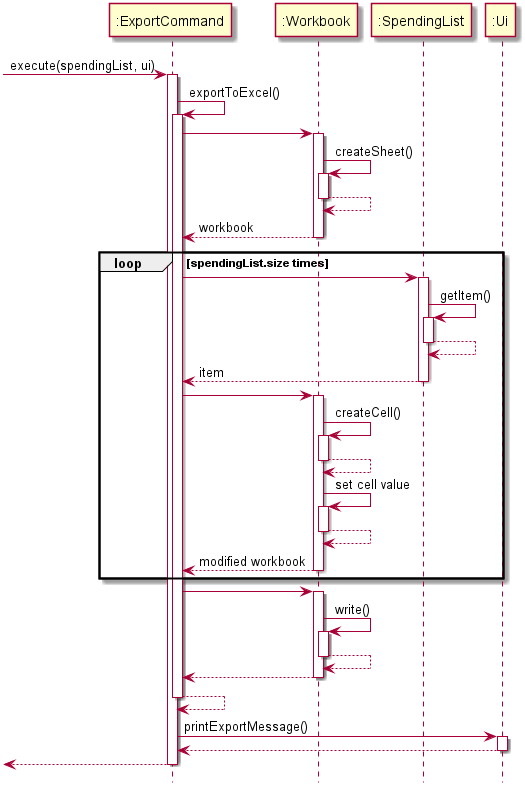

# Developer Guide

## 1. Introduction
Cent Wise Dollar Wise is a desktop application for money management, optimised for use via a Command Line Interface (CLI). This application aims to help NUS hostel students manage their financial situation and track their spending efficiently. 
This developer guide provides information on the architecture and design of the application. It will not only help you get started as a Cent Wise Dollar Wise contributer, but that you will find useful to refer to even if you are already a contributer of this project. 

## 2. Setting up
### 2.1 Prerequisites
- JDK 1.8.0_60 or later  
🛈 Having any Java 8 version is not enough.  
🛈 This app will not work with earlier versions of Java 8.
- IntelliJ IDE  
🛈 IntelliJ by default has Gradle and JavaFx plugins installed.  
🛈 Do not disable them. If you have disabled them, go to File > Settings > Plugins to re-enable them.
### 2.2 Setting up the project in your computer
1. Fork this repo, and clone the fork to your computer.
2. Open IntelliJ. If you are not in the welcome screen, click File > Close Project to close the existing project dialog first.
3. Set up the correct JDK version for Gradle.
4. Click Configure > Project Defaults > Project Structure.
5. Click New…​ and find the directory of the JDK.
6. Click Import Project.
7. Locate the build.gradle file and select it. Click OK
8. Click Open as Project
9. Click OK to accept the default settings
10. Open a console and run the command gradlew processResources (Mac/Linux: ./gradlew processResources). It should finish with the BUILD SUCCESSFUL message. This will generate all resources required by the application and tests.
### 2.3 Verifying the setup
1. Run the seedu.duke.Duke and try a few commands.
2. Run the tests and ensure all the tests pass.

## 3. Design & implementation
### 3.1 Architecture

The architecture diagram above explains the high-level design of the application. Given below is a quick overview of each component:

Main: Initializes spending list at app launch and coordinates the interaction between other components

DukeException: Issues exceptions if there are errors in storage or wrong format of user input is detected

SpendingList: Stores the expenditure of the user as individual entries

Storage: Reads data from, and writes data to, the hard disk

Ui: Interacts with the user

Command: Executes the user command or system-issued command

Parser: Analyzes the user command

**How the architecture components interact with each other**  

The sequence diagram below shows how the components interact with each other when the user issues a general command.

### 3.2 Edit Feature
`SpendingList` and `Ui` facilitate this feature. The Edit feature is able to edit the existing items in the spending list. 
It implements the following operations:
* `SpendingList#editItemDescription(index, description)` → updates the description of the item in the spending list
* `SpendingList#editItemCategory(index, description)` → updates the category of the item in the spending list
* `SpendingList#editItemAmount(index, amount)` → updates the amount of the item in the spending list
* `Ui#printEdit(spendingList, index)` → prints the message to show the successful completion of the edition process

Below shows an example of the usage:
1. User executes `edit 1 bubble tea` command to edit the first item in the spending list to bubble tea 
2. The `edit` command calls the `EditCommand#execute(spendingList, ui)` to complete the edition process

Figure below shows the sequence diagram of `EditCommand` class.

### 3.3 Convert Feature
`SpendingList`, `Ui` and `Item` facilitate this feature. The Convert feature is able to convert the currency of the items 
stored in the spending list. It implements the following operations:
* `SpendingList#getSpendingList()` → retrieves the current spending list
* `ConvertCommand#identifyCurrency(description)` → identifies the currency after conversion
* `ConvertCommand#findExchangeRate()` → finds the corresponding exchange rate
* `Item#editAmount(amount)` → updates the new amount after conversion
* `Item#editSymbol(currency)` → updates the new currency after conversion
* `SpendingList#updateSpendingList()` → updates the spending list after conversion 
* `Ui#printConvertCurrency(outputCurrency)` → prints the message to show the successful completion of the conversion 
process

Below shows an example of the usage:
1. User executes `convert SGD USD` command to convert the currency from SGD to USD
2. The `convert` command calls the `ConvertCommand#execute(spendingList, ui)` to complete the conversion process

Figure below shows the sequence diagram of `ConvertCommand` class.

### 3.4 Set Budget Feature
`Budget` and `Ui` facilitate this feature. The Set Budget feature is able to set the budget limit for the spending. 
It implements the following operations:
* `SetBudgetCommand#identifyBudgetLimit(description)` → identifies the budget limit input by the user
* `Budget#addBudget(currency, budgetLimit)` → stores the budget limit with its corresponding currency
* `Ui#printBudgetLimit(currency, budgetLimit)` → prints the message to show the successful completion of the setting 
budget process

Below shows an example of usage:
1. User executes `set SGD 100.0` to set the budget limit to SGD 100.0
2. The `set` command calls `SetBudgetCommand#execute(spendingList, ui)` to complete the setting budget process

Figure below shows the sequence diagram of SetBudgetCommand class.

### 3.5 Warn Feature
`Budget`, `SpendingList` and `Ui` facilitate this feature. The Warn feature is able to warn the user when the total 
spending amount approaches the threshold of 90% of the budget limit or when the total spending amount exceeds 
the budget limit. It implements the following operations:
* `Budget#getCurrency()` → retrieves the corresponding currency for the budget
* `Budget#getBudgetLimit()` → retrieves the budget limit
* `SpendingList#getCurrentAmount()` → gets the total amount of spending in the spending list
* `Ui#printApproachingWarningMessage(outputCurrency, amountRemaining)` → prints the warning message that the spending 
is approaching budget limit (i.e. exceeds the threshold value of 90% of the budget limit but not yet exceed it), with 
the amount remaining
* `Ui#printExceedingWarningMessage()` → prints the warning message that the spending has exceeded the budget limit

Below shows an example of usage:
1. User adds the spending to the spending list after setting the budget limit
2. The `add` command calls `WarnCommand#execute(spendingList, ui)` to check if the user approaches or exceeds budget 
limit 

Figure below shows the sequence diagram of WarnCommand class.

### 3.6 Repay Feature
`RepaymentList` and `Ui` facilitate this feature. The Repay feature is able to store the repayment information as a 
remainder to the user. It implements the following operations:
* `RepaymentList#storeCurrentString()` → stores the repayment information to the repayment list
* `Ui#printRepay(repaymentList.returnCurrentString()` → prints the repayment information which has been successfully stored

Below shows an example of usage:
1. User executes `repay Johnny SGD 5.0 2020-12-20` command to add the repayment information that one has to repay 
SGD 5.0 to Johnny before 2020-12-20
2. The `repay` command calls the `RepayCommand#execute(spendingList, ui)` to complete the adding process

Figure below shows the sequence diagram of `RepayCommand` class:

### 3.7 Summary Feature
`SpendingList` and `Item` facilitate this feature. The Summary feature is able to summarise the total amount spent 
given a date. It implements the following operations:
* `Item#getDate()` → gets the date when user spent on the item
* `Item#getAmount()` → gets the amount spent on the item
* `SpendingList#getSpendingAmountTime(period)` → gets the total amount spent during a period
* `SpendingList#getSpendingAmountCategory(category, period)` → gets the total amount spent of a given category

Below shows an example of usage:

1. User executes the `summary 2020` command to get the amount spent during year 2020.
2. The `summary` command calls the `SpendinList#getSpendingAmount(2020)` which checks the spending date of every items
stored in the memory.
3. If the item is spent during year 2020, the amount spent will be summed up.

Figure below shows the sequence diagram of `SummaryCommand` class:

### 3.8 Reminder Feature
`SpendingList` and `WarnCommand` facilitate this feature. The Reminder feature is able to provide the user about the 
total expenditure of the current week, starting on Monday. It implements the following operations:
* `SpendingList#getSpendingAmountTime(period)` 
* `WarnCommand#execute(spendingList, ui)`

Below shows an example of usage:

1. User starts the application.
2. The `Reminder` will be instantiated. The dates of the current week (starting from Monday) will be saved to a list.
3. In the `Reminder#execute(spendinglist, ui)`, a check will be done to see if there is any budget being set by the user.
    * If no budget is being set, the total expenditure of current week will be tallied up. 
    * If there is, `WarnCommand#execute(spendingList, ui)` will be called first before tallying up the expenditure. 

Figure below shows the sequence diagram of Reminder class: 

### 3.9 Export Feature
`Workbook`, `FileOutputStream`, `SpendingList` and `Ui` facilitate this feature. The export data feature could extract the current data and export to an Excel file. It implements the following operations:
* `Workbook#createSheet()` → creates a sheet in the workbook
* `SpendingList#getItem()` → gets the item waiting to be added to the workbook
* `Workbook#write()` → writes the data to an Excel file
* `Ui#printExportMessage()` → prints the message indicating that the Excel file has been created successfully

Below shows an example of usage:

1. User executes the `export F:\` command to export the data to the location `F:\`.
2. The `export` command calls the `Workbook#createSheet()` to create an Excel workbook sheet.
3. `SpendingList#getItem()` will be called repeatedly to get items and set the cells' values accordingly.
3. After writing to an Excel file at the location `F:\` using `Workbook#write()`, a prompt message will be shown by `Ui`.

Figure below shows the sequence diagram of `ExportCommand` class:

## 4. Product scope
### 4.1 Target user profile

The target user is NUS hostel students including both local students and international students.

### 4.2 Value proposition

We observed that hostel students are encountering tight budgets due to expensive hostel fees, on top of their school 
tuition fees. Hence, we are developing a money manager targeted at NUS hostel students. This money manager   
Cent Wise Dollar Wise aims to help hostel students to have better financial management with limited budget. 

## 5. User Stories

|Version| As a ... | I want to ... | So that I can ...|
|--------|----------|---------------|------------------|
|v1.0|international student|convert local currency to foreign currency or the reverse way|trace my spending easily|
|v1.0|careless user|view and reset the previous input|ensure the data input is correct|
|v1.0|user|have a monthly/yearly summary|know how much I had spent|
|v2.0|user|set a budget limit|be less likely to overspend my money|
|v2.0|user|be warned when my spending approaches the budget limit or exceeds the budget limit|be less likely to overspend my money|
|v2.0|big spender|tag purchases according to categories|for an easier overview|
|v2.0|user|have weekly reminders on how much has spent|take note of future spending|
|v2.0|forgetful user|include a list to summarise the repayment to others|repay the debt on time|

## 6. Non-Functional Requirements

{Give non-functional requirements}

## 7. Glossary

* *glossary item* - Definition

## 8. Instructions for manual testing

{Give instructions on how to do a manual product testing e.g., how to load sample data to be used for testing}
