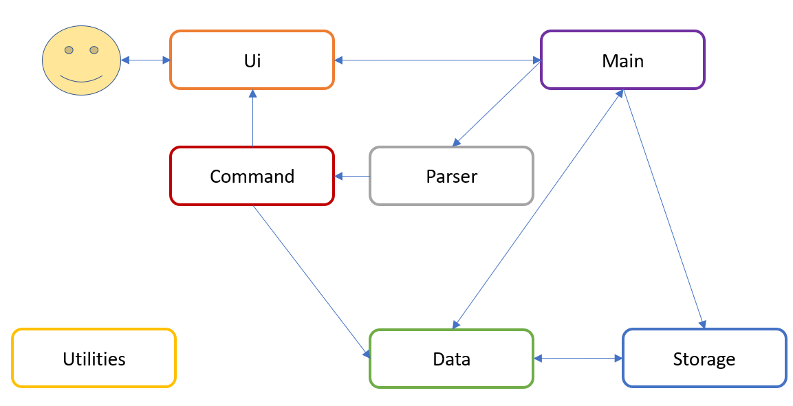
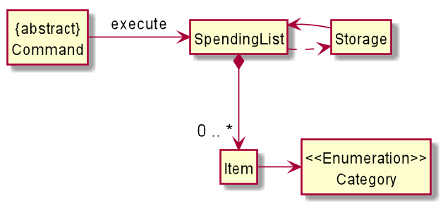
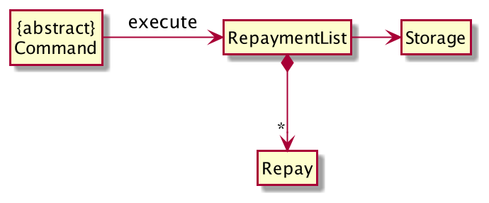
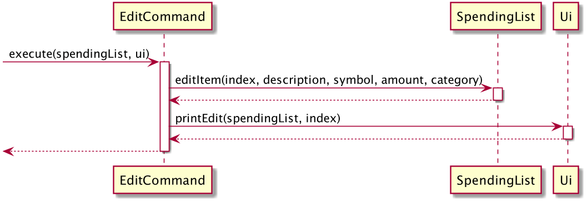
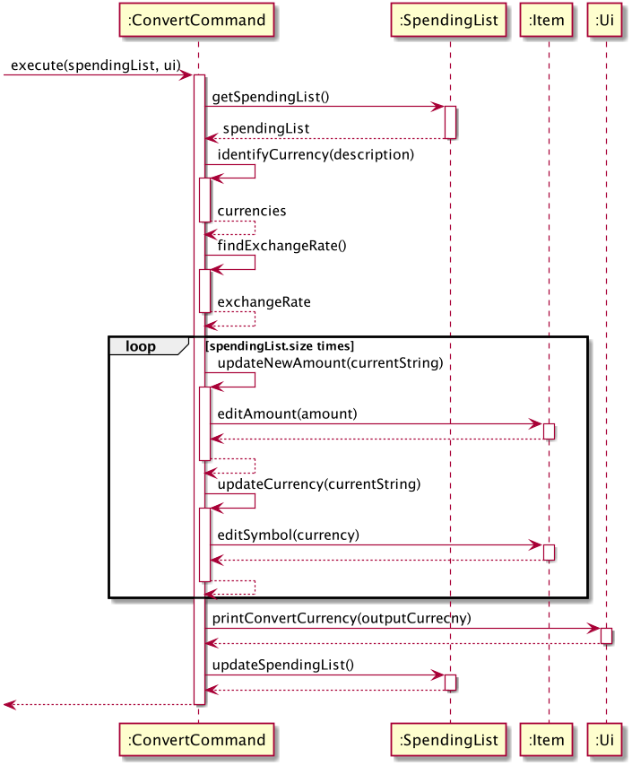
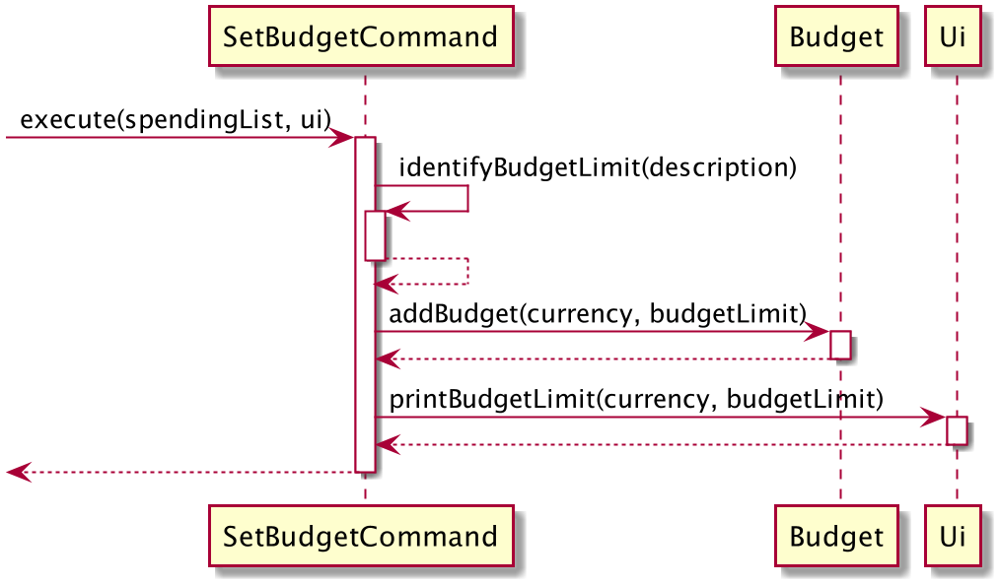
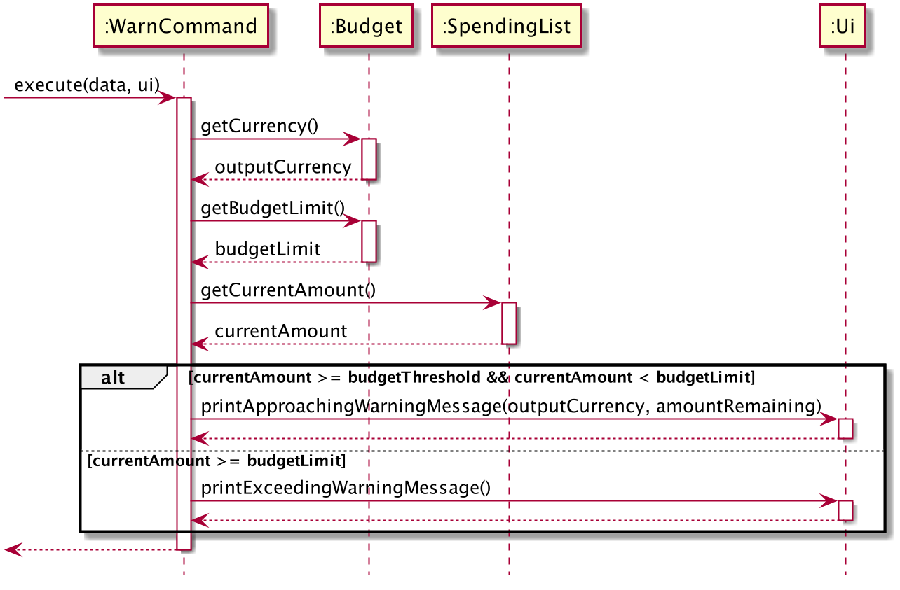
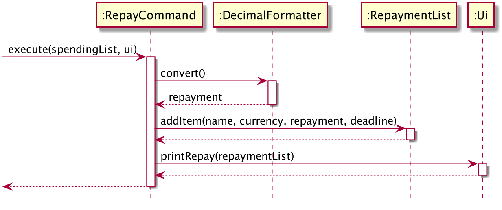
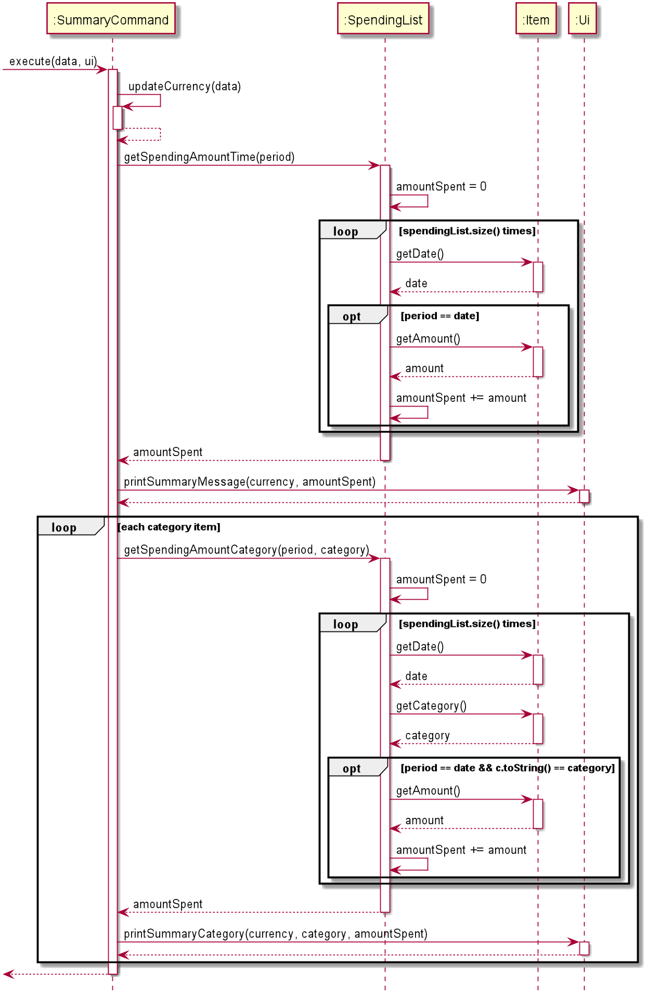

# Developer Guide

-----

## Content Page
1. [Introduction](#1-introduction)
2. [Setting Up](#2-setting-up)

    2.1 [Prerequisites](#21-prerequisites)

    2.2 [Setting Up the Project in your Computer](#22-setting-up-the-project-in-your-computer)

    2.3 [Verifying the Setup](#23-verifying-the-setup)

3. [Design](#3-design)

    3.1 [Architecture](#31-architecture)

    3.2 [UI Component](#32-ui-component)

    3.3 [Parser Component](#33-parser-component)

    3.4 [Command Component](#34-command-component)

    &nbsp;&nbsp;&nbsp;&nbsp;&nbsp;&nbsp;3.4.1 [CLI `Command`s related to Spending List](#341-cli-commands-related-to-spending-list)
    
    &nbsp;&nbsp;&nbsp;&nbsp;&nbsp;&nbsp;3.4.2 [CLI `Command`s related to Repayment List](#342-cli-commands-related-to-repayment-list)
    
    &nbsp;&nbsp;&nbsp;&nbsp;&nbsp;&nbsp;3.4.3 [CLI `Command`s related to Budget](#343-cli-commands-related-to-budget)

    &nbsp;&nbsp;&nbsp;&nbsp;&nbsp;&nbsp;3.4.4 [General CLI `Command`s](#344-general-cli-commands)

    &nbsp;&nbsp;&nbsp;&nbsp;&nbsp;&nbsp;3.4.5 [Hidden `Command`s](#345-hidden-commands)

    3.5 [Data Component](#35-data-component)

    &nbsp;&nbsp;&nbsp;&nbsp;&nbsp;&nbsp;3.5.1 [Spending List](#351-spending-list)

    &nbsp;&nbsp;&nbsp;&nbsp;&nbsp;&nbsp;3.5.2 [Repayment List](#352-repayment-list)

    3.6 [Storage Component](#36-storage-component)

4. [Implementation](#4-implementation)

    4.1 [Add Feature](#41-add-feature)
    
    4.2 [Clear Feature](#42-clear-feature)
    
    4.3 [Edit Feature](#43-edit-feature)
    
    4.4 [Convert Feature](#44-convert-feature)
    
    4.5 [Set Budget Feature](#45-set-budget-feature)
    
    4.6 [Warn Feature](#46-warn-feature)
    
    4.7 [Repay Feature](#47-repay-feature)
    
    4.8 [Summary Feature](#48-summary-feature)
    
    4.9 [Reminder Feature](#49-reminder-feature)
    
    4.10 [Encouragement Feature](#410-encouragement-feature)
    
    4.11 [Export Feature](#411-export-feature)
    
    4.12 [Draw Feature](#412-draw-feature)
    
5. [Dev Ops](#5-dev-ops)

    5.1 [Build Automation](#51-build-automation)
    
    5.2 [Continuous Integration](#52-continuous-integration-ci)
    
    5.3 [Making a Release](#53-making-a-release)
    
    5.4 [Coverage Reporting](#54-coverage-reporting)
    
Appendix A: [About the Product](#appendix-a-about-the-product)

Appendix B: [User Stories](#appendix-b-user-stories)

Appendix C: [Non-Functional Requirements](#appendix-c-non-functional-requirements)

Appendix D: [Glossary](#appendix-d-glossary)

Appendix E: [Instructions for Manual Testing](#appendix-e-instructions-for-manual-testing)

------

## 1. Introduction
Cent Wise Dollar Wise is a desktop application for money management, optimised for use via a Command Line Interface (CLI). This application aims to help NUS hostel students manage their financial situation and track their spending efficiently. 
This developer guide provides information on the architecture and design of the application. It will not only help you get started as a Cent Wise Dollar Wise contributor, but that you will find useful to refer to even if you are already a contributor of this project. 

## 2. Setting Up
### 2.1 Prerequisites
- JDK 11  
- IntelliJ IDE  
🛈 IntelliJ by default has Gradle and JavaFx plugins installed.  
🛈 Do not disable them. If you have disabled them, go to File > Settings > Plugins to re-enable them.

### 2.2 Setting Up the Project in your Computer
The following are the steps to set up the project in your computer:
1. Fork this repo, and clone the fork to your computer.
2. Open IntelliJ. If you are not in the welcome screen, click File > Close Project to close the existing project dialog first.
3. Set up the correct JDK version for Gradle.
4. Click Configure > Project Defaults > Project Structure.
5. Click New…​ and find the directory of the JDK.
6. Click Import Project.
7. Locate the build.gradle file and select it. Click OK
8. Click Open as Project
9. Click OK to accept the default settings
10. Open a console and run the command `gradlew processResources` (Mac/Linux: `./gradlew processResources`). It should finish with the BUILD SUCCESSFUL message. This will generate all resources required by the application and tests.

### 2.3 Verifying the Setup
The following are the steps to verify your setup:
1. Run the seedu.duke.Duke and try a few commands.
2. Run the tests and ensure all the tests pass.

## 3. Design
### 3.1 Architecture
  

The architecture diagram above explains the high-level design of the application. Given below is a quick overview of each component:

`main`: Initializes spending list at app launch and coordinates the interaction between other components

`data`: Stores the data collected from the user

`storage`: Reads data from, and writes data to, the hard disk

`ui`: Interacts with the user

`command`: Executes the user command or system-issued command

`parser`: Analyzes the user command

`utilities`: Contains classes that are used by multiple components

**How the Architecture Components Interact with Each Other**  

The sequence diagram below shows how the components interact with each other when the user issues a general command.  

  

### 3.2 UI Component
This component, consisting of the `Ui` class, is responsible for receiving user input and displaying appropriate output messages for the user. This includes error messages, warning messages, encouragement quotes, and messages that indicate if a command is successfully executed. 

### 3.3 Parser Component

### 3.4 Command Component
Every command that a user can input into the application is represented by an object that extends the abstract class `Command`. In addition, hidden commands that do not require user inputs also extends from the same abstract class `Command`. `Command` contains some basic methods that are shared by all types of commands, including:
* execute(), which is called after setting up the object appropriately, to perform the action requested by the user; and
* isExit(), which returns a boolean that indicates whether the program should terminate after the command is executed.

The following sections classify the `Command`s into different types based on their functionality within the application.

#### 3.4.1 CLI `Command`s related to Spending List
The following class diagram describes the CLI `Command`s specifically related to the spending list.  

  

#### 3.4.2 CLI `Command`s related to Repayment List
The following class diagram describes the CLI `Command`s specifically related to the repayment list.  

#### 3.4.3 CLI `Command`s related to Budget
The following class diagram describes the CLI `Command`s specifically related to the budget.  

#### 3.4.4 General CLI `Command`s 
The following class diagram describes general CLI `Command`s that apply to the whole application.  

#### 3.4.5 Hidden `Command`s
The following class diagram describes the hidden commands within the program.  

### 3.5 Data Component
This component holds the data of the application, including the SpendingList class and RepaymentList class, 
in the memory.

#### 3.5.1 Spending List
The SpendingList class stores a list of `Item` objects that the user has spent. The `SpendingList` does not depend on 
Ui, Parser and Storage components. 

Below shows a class diagram how `SpendingList` interacts with other classes.  

#### 3.5.2 Repayment List
The RepaymentList class stores a list of `Repay` objects. Similar to SpendingList class, RepaymentList class does not 
depend on other components. 

Below shows a class diagram how `RepaymentList` interacts with other classes.  

### 3.6 Storage Component

## 4. Implementation
### 4.1 Add Feature
`SpendingList`, `SpendingListCategoriser` and `Ui` facilitate this feature. The Add feature is able to add a new item into the spending list. It implements the following operations:
* `AddCommand#updateAmount` → converts amount to SGD
* `AddCommand#updateCurrency` → updates currency to SGD
* `SpendingList#addItem` → adds item into the spending list
* `Ui#printAdd` → prints the message that the item is successfully added into the spending list
* `SpendingListCategoriser#execute`→ categorises the item in the spending list
* `WarnCommand#execute` → prints warning message if total spending amount approaches the threshold of 90% of the budget limit or when the total spending amount exceeds the budget limit

Below shows an example of usage:
1. User types `add -c food -d beer -s USD 10` to add chicken rice into the spending list
2. The `add` command calls `AddCommand#execute`
3. `AddCommand#execute` calls the following operations in order:
   1. AddCommand#updateAmount to convert the amount “10” to SGD
   2. AddCommand#updateCurrency to update the currency from “USD” to “SGD”
   3. SpendingList#addItem to add beer into the spending list
   4. Ui#printAdd to print a message if beer is successfully added into the spending list
   5. SpendingListCategoriser#execute to categorise beer under the food category of the spending list
   6. WarnCommand#execute to print a warning message if required
   
The following sequence diagram illustrates how this feature works.  

  

### 4.2 Clear Feature
`SpendingList`, `RepaymentList` and `Budget` facilitate this feature. The Clear feature is able to clear existing data (either budget, repayment entries, spending entries, or all), according to the user’s command. It implements the following operations:
* `ClearBudgetCommand#execute` → clears budget and prints message output
* `ClearSpendingListCommand#execute` → clears spending list and prints message output
* `ClearRepaymentListCommand#execute` → clears repayment list and prints message output
* `PurgeDataCommand#execute` → clears all data from budget, spending list and repayment list, and prints message output
* `Budget#clearBudget` → clears budget
* `RepaymentList#deleteRepaymentEntry` → deletes a particular entry of the repayment list
* `RepaymentList#clearAllEntries` → clears all entries of the repayment list
* `Ui#printClearAllRepaymentList` → prints the message that all entries in the repayment list are cleared
* `SpendingList#deleteItem` → deletes a particular entry of the spending list
* `SpendingList#clearAllItems` → clears all entries of the spending list
* `Ui#printClearAllSpendingList` → prints the message that all entries in the spending list are cleared
* `Ui#printClearIndex` → prints the message that an entry is cleared from either the repayment list or the spending list
* `Ui#printPurgeData` → prints the message that all data is cleared

Below shows an example of usage:
1. User types `clear -s 1` to clear the first entry in the spending list.
2. ClearSpendingListCommand calls `ClearSpendingListCommand#execute`, which calls the following operations in order:
   1. SpendingList#clearAllItems to clear all items in the spending list and saves the updated spending list in storage.
   2. Ui#printClearAllSpendingList to print a message if the spending list is cleared successfully
   
The following sequence diagram illustrates how clearing a spending list works.  

  

### 4.3 Edit Feature
`SpendingList`, `AmountConverter`, `DecimalFormatter` and `Ui` facilitate this feature. The Edit feature is able to edit the existing items in the spending list. 
It implements the following operations:
* `EditCommand#execute` → edit the spending list accordingly and calls the ui to print message output
* `SpendingList#editItemDescription` → updates the description of the item in the spending list
* `SpendingList#editItemCategory` → updates the category of the item in the spending list
* `SpendingList#editItemAmount` → updates the amount of the item in the spending list
* `AmountConverter#updateAmount` → converts the amount based on the default currency
* `AmountConverter#updateCurrency` → converts the currency to the default currency
* `DecimalFormatter#convert` → converts the amount to 4 d.p.
* `Ui#printEdit` → prints the message to show the successful completion of the edition process

Below shows an example of the usage:
1. User executes `edit 1 bubble tea` command to edit the first item in the spending list to bubble tea
2. The `edit` command calls the `EditCommand#execute` to complete the edition process

The following sequence diagram illustrates how this feature works.  

  

### 4.4 Convert Feature
`SpendingList` and `Ui` facilitate this feature. The Convert feature is able to convert the currency of the items 
stored in the spending list. It implements the following operations:
* `ConvertCommand#execute` → converts currency and calls the ui to print message output
* `SpendingList#getSpendingList` → retrieves the current spending list
* `ConvertCommand#identifyCurrency` → identifies the currency after conversion
* `ConvertCommand#findExchangeRate` → finds the corresponding exchange rate
* `ConvertCommand#updateList` → updates the new amount and the new currency after conversion
* `SpendingList#updateSpendingList` → updates the spending list after conversion 
* `ConvertCommand#updateBudgetList` → updates the budget limit after conversion 
* `Ui#printConvertCurrency` → prints the message to show the successful completion of the conversion 
process

Below shows an example of the usage:
1. User executes `convert SGD USD` command to convert the currency from SGD to USD
2. The `convert` command calls the `ConvertCommand#execute` to complete the conversion process

The following sequence diagram illustrates how this feature works.  

  

### 4.5 Set Budget Feature
`Budget`, `AmountConverter` , `DecimalFormatter` and `Ui` facilitate this feature. The Set Budget feature is able to set the budget limit for the spending. 
It implements the following operations:
* `AmountConverter#updateAmount` → converts the budget limit based on the default currency
* `AmountConverter#updateCurrency` → converts the currency to the default currency
* `DecimalFormatter#convert` → converts the budget limit to 4 d.p.
* `Budget#addBudget` → stores the budget limit with its corresponding currency
* `Ui#printBudgetLimit` → prints the message to show the successful completion of the setting 
budget process

Below shows an example of usage:
1. User executes `set SGD 100.0` to set the budget limit to SGD 100.0
2. The `set` command calls `SetBudgetCommand#execute` to complete the setting budget process

The following sequence diagram illustrates how this feature works.  

  

### 4.6 Warn Feature
`Budget`, `SpendingList` and `Ui` facilitate this feature. The Warn feature is able to warn the user when the total 
spending amount approaches the threshold of 90% of the budget limit or when the total spending amount exceeds 
the budget limit. It implements the following operations:
* `Budget#getCurrency` → retrieves the corresponding currency for the budget
* `Budget#getBudgetLimit` → retrieves the budget limit
* `SpendingList#getCurrentAmount` → gets the total amount of spending in the spending list
* `Ui#printApproachingWarningMessage` → prints the warning message that the spending 
is approaching budget limit (i.e. exceeds the threshold value of 90% of the budget limit but not yet exceed it), with 
the amount remaining
* `Ui#printExceedingWarningMessage` → prints the warning message that the spending has exceeded the budget limit

Below shows an example of usage:
1. User adds the spending to the spending list after setting the budget limit
2. The `add` command calls `WarnCommand#execute` to check if the user approaches or exceeds budget 
limit 

The following sequence diagram illustrates how this feature works.  

  

### 4.7 Repay Feature
`RepaymentList`, `DecimalFomatter` and `Ui` facilitate this feature. The Repay feature is able to store the repayment information as a 
remainder to the user. It implements the following operations:
* `DecimalFormatter#convert` → converts the repayment amount to 4 d.p.
* `RepaymentList#AddItem` → adds the repayment information to the repayment list
* `Ui#printRepay` → prints the repayment information which has been successfully stored

Below shows an example of usage:
1. User executes `repay Johnny SGD 5.0 2020-12-20` command to add the repayment information that one has to repay 
SGD 5.0 to Johnny before 2020-12-20
2. The `repay` command calls the `RepayCommand#execute` to complete the adding process

The following sequence diagram illustrates how this feature works.  

  

### 4.8 Summary Feature
`SpendingList` and `Item` facilitate this feature. The Summary feature is able to summarise the total amount spent 
given a date. It implements the following operations:
* `Item#getDate` → gets the date when user spent on the item
* `Item#getAmount` → gets the amount spent on the item
* `SpendingList#getSpendingAmountTime` → gets the total amount spent during a period
* `SpendingList#getSpendingAmountCategory` → gets the total amount spent of a given category

Below shows an example of usage:

1. User executes the `summary 2020` command to get the amount spent during year 2020.
2. The `summary` command calls the `SpendinList#getSpendingAmount` which checks the spending date of every items
stored in the memory.
3. If the item is spent during year 2020, the amount spent will be summed up.

The following sequence diagram illustrates how this feature works. 

  

### 4.9 Reminder Feature
`SpendingList` and `WarnCommand` facilitate this feature. The Reminder feature is able to provide the user about the 
total expenditure of the current week, starting on Monday. It implements the following operations:
* `SpendingList#getSpendingAmountTime` 
* `WarnCommand#execute`

Below shows an example of usage:

1. User starts the application.
2. The `ReminderCommand` will be instantiated. The dates of the current week (starting from Monday) will be saved to a list.
3. In the `ReminderCommand#execute(data, ui)`, a check will be done to see if there is any budget being set by the user.
    * If no budget is being set, the total expenditure of current week will be tallied up. 
    * If there is, `WarnCommand#execute(data, ui)` will be called first before tallying up the expenditure. 

The following sequence diagram illustrates how this feature works.  

  

### 4.10 Encouragement Feature
The Ui facilitate this feature. The Encouragement feature regularly encourages the user to keep up his effort in using the application. It implements the following operation:
Ui#printEncouragementMessage() → prints an encouragement message for the user

This is a hidden feature that will be executed automatically by the application when the application is launched. Figure below shows the sequence diagram of `EncouragementCommand` class.

The following sequence diagram illustrates how this feature works.  

  

### 4.11 Export Feature
`Workbook`, `FileOutputStream`, `SpendingList` and `Ui` facilitate this feature. The export data feature could extract the current data and export to an Excel file. It implements the following operations:
* `Workbook#createSheet` → creates a sheet in the workbook
* `SpendingList#getItem` → gets the item waiting to be added to the workbook
* `Workbook#write` → writes the data to an Excel file
* `Ui#printExportMessage` → prints the message indicating that the Excel file has been created successfully

Below shows an example of usage:

1. User executes the `export F:\` command to export the data to the location `F:\`.
2. The `exportCommand` calls the `Workbook#createSheet()` to create an Excel workbook sheet.
3. `SpendingList#getItem` will be called repeatedly to get items and set the cells' values accordingly.
3. After writing to an Excel file at the location `F:\` using `Workbook#write`, a prompt message will be shown by `Ui`.

The following sequence diagram illustrates how this feature works.  

  

### 4.12 Draw Feature
`Workbook`, `FileOutputStream`, `SpendingList` and `Ui` facilitate this feature. The draw feature analyze the target records and plot two charts accordingly. It implements the following operations:
* `Workbook#createSheet` → creates a sheet in the workbook
* `SpendingList#getItem` → gets the item waiting to be added to the workbook
* `DrawCommand#getYearMap` `DrawCommand#getMonthMap` `DrawCommand#getDayMap` → returns a map containing the information of sum of amount in records
* `DrawCommand#getCategories` → returns a map containing the information of proportions of different categories
* `DrawCommand#drawChart` → generate charts in the worksheet
* `Workbook#write` → writes the data to an Excel file
* `Ui#printDrawMessage` → prints the message indicating that the charts have been generated successfully

Below shows an example of usage:

1. User executes the `draw 2020` command to generate charts for year 2020.
2. The `drawCommand` calls the `Workbook#createSheet()` twice to create two Excel workbook sheet.
3. `SpendingList#getItem` will be called repeatedly to get items.
4. `DrawCommand#getMonthMap` and `DrawCommand#getCategories` will be called to analyze the data and decide which data are going to be shown in charts.
5. After processing of data, `DrawCommand#drawChart` will be called to generate charts in worksheets.
6. After writing to an Excel file using `Workbook#write`, a prompt message will be shown by `Ui`.

The following sequence diagram illustrates how this feature works.  

  

## 5 Dev Ops
### 5.1 Build Automation
This project uses Gradle for build automation and dependency management.  

Given below are how to use Gradle for some important project tasks:  

* `clean`: Deletes the files created during the previous build tasks (e.g. files in the build folder). e.g. ./gradlew clean
* `shadowJar`: Uses the ShadowJar plugin to creat a fat JAR file in the build/lib folder, if the current file is outdated. e.g. ./gradlew shadowJar
* `run`: Builds and run the program. 
* `runShadow`: Builds the application as a fat JAR, and then runs it.
* `checkstyleMain`: Runs the code style check for the main code base. 
* `checkstyleTest`: Runs the code style check for the test code base.
* `test`: Runs all tests.
  * `./gradlew test` — Runs all tests
  * `./gradlew clean test` — Cleans the project and runs tests

### 5.2 Continuous Integration (CI)
This project uses GitHub Actions for CI. The project comes with the necessary GitHub Actions configurations files (in the .github/workflows folder). 

### 5.3 Making a release
Here are the steps to create a new release:

1. Generate a fat JAR file using Gradle by using the command `gradlew shadow` (Mac/Linux: `./gradlew clean shadowJar`).
2. Find the JAR file in the `build/libs` directory.
3. Tag the repository with a new version number.
4. [Create a new release using GitHub](https://help.github.com/articles/creating-releases/). Upload the JAR file you created.

### 5.4 Coverage Reporting
We use the IntelliJ IDEA’s coverage analysis tool for coverage reporting. A video tutorial on how to use this tool can be found [here](https://www.youtube.com/watch?v=yNYzZvyA2ik&feature=youtu.be).

## Appendix A: About the Product
### Target User Profile
The target user is NUS hostel students including both local students and international students.

### Value Proposition
We observed that hostel students are encountering tight budgets due to expensive hostel fees, on top of their school 
tuition fees. Hence, we are developing a money manager targeted at NUS hostel students. This money manager   
Cent Wise Dollar Wise aims to help hostel students to have better financial management with limited budget. 

## Appendix B: User Stories
This table describes the user stories considered while implementing the features in Section 4:  

|Version| As a (/an) ... | I want to ... | So that I can ...|
|--------|----------|---------------|------------------|
|v1.0|international student|convert local currency to foreign currency or the reverse way|trace my spending easily|
|v1.0|careless user|view and reset the previous input|ensure the data input is correct|
|v1.0|user|have a monthly/yearly summary|know how much I had spent|
|v2.0|user|set a budget limit|be less likely to overspend my money|
|v2.0|user|be warned when my spending approaches the budget limit or exceeds the budget limit|be less likely to overspend my money|
|v2.0|big spender|tag purchases according to categories|for an easier overview|
|v2.0|user|have weekly reminders on how much has spent|take note of future spending|
|v2.0|forgetful user|include a list to summarise the repayment to others|repay the debt on time|

## Appendix C: Non-Functional Requirements
The following statements describe the non-functional requirements for the application:  

1. The system should respond within two seconds.
2. The system should be easy to use, do not require much effort to learn.
3. The system should work on any *mainstream* OS that has Java 11 or above installed.
4. Users with faster typing speed than average should be able to use this program with ease.

## Appendix D: Glossary
* Mainstream OS: Windows, Linux, macOS

## Appendix E: Instructions for Manual Testing
Given below are the instructions to test the application manually.

### E.1 Launch
1. Download the jar file and copy into an empty folder.
2. Navigate to the folder in the command prompt.
3. Enter `java -jar Duke.jar` and press `enter` to launch the application. 
4. You should expect a new `data` folder created within the same folder as the jar file. This `data` folder will contain a file named `duke.json`.

### E.2 Application Commands
#### 1. `Draw` Command
Test the command by executing `draw 2020`. You should expect to see the following output in Microsoft Excel.  

#### 2. Other Commands
Please refer to [Cent Wise Dollar Wise User Guide](https://ay2021s1-cs2113t-f14-2.github.io/tp/UserGuide.html).
