# User Guide
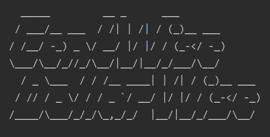

--------

## Table of Contents
1. [Introduction](#1-introduction)

2. [Quick Start](#2-quick-start)

3. [Command Features](#3-command-features)  
    3.1 [Adding Spending: `add`](#31-adding-spending-add) 
    3.2 [Clearing Data: `clear`](#32-clearing-data-clear)    
    3.3 [Viewing Help: `help`](#33-viewing-help-help)   
    3.4 [Purging Data: `purge`](#34-purging-data-purge-data)  
    3.5 [Viewing Repayment List Summary: `repayment list`](#35-viewing-repayment-list-summary-repayment-list)    
    3.6 [Viewing Spending List Summary: `spending list`](#36-viewing-spending-list-summary-spending-list)    
    3.7 [Viewing Budget Limit: `view`](#37-viewing-budget-limit-view)    
    3.8 [Setting Budget Limit: `set`](#38-setting-budget-limit-set)    
    3.9 [Inputting Repayment Information: `repay`](#39-inputting-repayment-information-repay)    
    3.10 [Converting Currency: `convert`](#310-converting-currency-convert)       
    3.11 [Viewing Summary: `summary`](#311-viewing-summary-summary)        
    3.12 [Visualizing Data: `draw`](#312-visualizing-data-draw)    
    3.13 [Exporting Data: `export`](#313-exporting-data-export)     
    3.14 [Editing Spending: `edit`](#314-editing-spending-edit)        
    3.15 [Exiting Program: `logout`](#315-exiting-program-logout)

4. [Useful Hidden Features](#4-useful-hidden-features)    
    4.1 [Reminder](#41-reminder)    
    4.2 [Warning](#42-warning)   
    4.3 [Encouragement](#43-encouragement)

5. [FAQ](#5-faq)

6. [Command Summary](#6-command-summary)

--------------------------------------------------------------------------------------------------------------------

## **1. Introduction**
Welcome to Cent Wise Dollar Wise User Guide! Cent Wise Dollar Wise is a desktop application for money management, optimised for use via a Command Line Interface (CLI). This application aims to help NUS hostel students manage their financial situation and track their spending efficiently. 
This user guide provides in-depth documentation on the application’s installation process and command features. 

## **2. Quick Start**
1. Ensure that you have Java 11 or above installed in your computer.
2. Download the latest version of `Duke` from [here](https://github.com/AY2021S1-CS2113T-F14-2/tp/releases).
3. Copy the file to a home folder you would like to use.
4. Open a terminal in that home folder and enter java -jar duke.jar to begin.
5. Type the desired command and press Enter to execute it. Tips: entering help will display the help window with a list of commands that could be executed.

Refer to the [Command Features](#3-command-features) below for details of each command.

## **3. Command Features**
In this section, specific information about each command will be explained. This includes the purpose of each command, and how it is formatted.

Before we begin, do take note of the following information which applies to all commands:
* This application only takes in currencies of SGD, USD and CNY.

* Words in UPPER_CASE are parameters that you should provide.
Example: In `-c CATEGORY`, `CATEGORY` is a parameter. `-c Food` would mean that the item belongs to the 'food' category.

* Parameters in square brackets (i.e. []) are options provided for you to choose to enter (no need to enter [] when entering the command). You may choose one out of all.
Example: `edit INDEX [-c CATEGORY] [-d NEW DESCRIPTION]` can be used as `edit 1 [-c Food]` or `edit 1 [-c NEW DESCRIPTION]`

* The abbreviation of `MONTH` is case sensitive. The system only accepts the abbreviation of `MONTH` with the first three letters, and the first
letter is capitalised. Example: `Jul` for July or `Oct` for October.

* The system only supports three different currencies including SGD, USD and CNY.

* The default currency of the system is SGD, but after calling `convert` feature, the default currency will be changed to the currency you have converted to.

* There are 6 main categories of spending items:
    1. Education
    2. Entertainment
    3. Food
    4. Health
    5. Transportation
    6. Utilities

Note: If you categorise an item in a category that is not from these six, the item will be categorised as Others.
    
### 3.1 Adding Spending: `add`
This command allows you to add a spending record to the application. 

Format:

`add -c CATEGORY -d DESCRIPTION -s CURRENCY AMOUNT`

Example of usage: 

`add -c Food -d chicken rice -s SGD 3.00` → adds chicken rice which costs SGD 3.00 into the food category of the spending list

Figure below shows an example for Add Spending feature:  

  

🛈 The date shown in the UI output refers to the date when an entry is recorded.

### 3.2 Clearing Data: `clear`
The `clear` command allows you to clear specific data that you have stored in the application. This includes your spending list, repayment list and budget. You can choose to clear all entries or specified entries of either your spending list or repayment list (or both). 

🛈 If you do not specify SPENDING_INDEX or REPAYMENT_INDEX but specify its corresponding prefix, the whole list representing it will be cleared.

Format:

`clear [-b] [-s SPENDING_INDEX] [-r REPAYMENT_INDEX]`

Example of usage:

`clear -b` → clears the budget limit set previously

`clear -s 1` → clears entry 1 of the spending list

`clear -r 1` → clears entry 1 of the repayment list

`clear -s` → clears the entire spending list

`clear -r` → clears the entire repayment list

Figure below shows an example for Clear Data feature:  

### 3.3 Viewing Help: `help`
If you are unsure on how to use a command, or would like to know more uses of a command, you can use this command to get more information.

Format:

`help`

You shall expect to see the following help screen:  

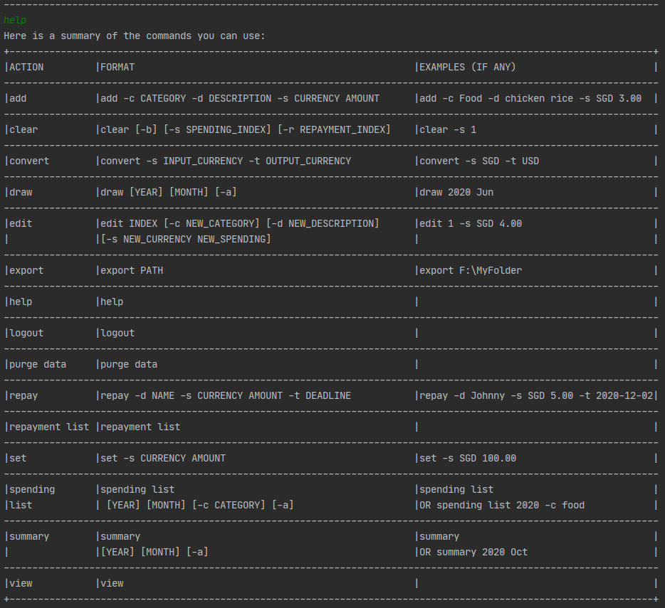

### 3.4. Purging Data: `purge data`
This command is similar to the `clear` command, except that it allows you to clear all data, including your spending list, repayment list and budget, all at one go.

Format:

`purge data`

Figure below shows an example for Purge Data feature:  

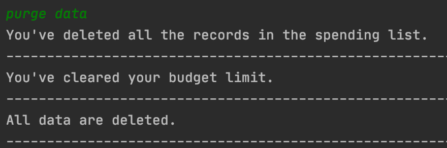

### 3.5 Viewing Repayment List Summary: `repayment list`
This command shows your repayment list.

Format:

`repayment list`

Figure below shows an example for View Repayment List Summary feature:  

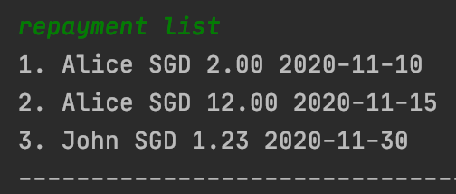

### 3.6 Viewing Spending List Summary: `spending list`

This command shows your spending records during a specified period (a particular year or month, or both).
You can also choose to view your spending records which belong to a specific spending category.

Format:

`spending list [YEAR] [MONTH] [-c CATEGORY] [-a]`

Examples of usage:

`spending list` → lists all entries for the current month

`spending list 2020 Jul` → lists all entries for July 2020

`spending list -c Food` → lists all food entries for the current month

Figure below shows an example for Spending List feature:  

Figure below shows an example for Spending List feature with specific month/year/category:  

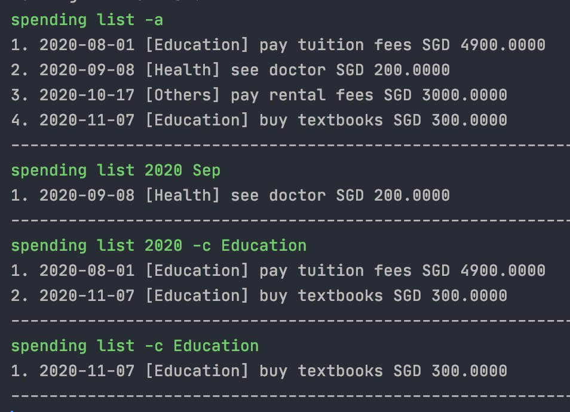

### 3.7 Viewing Budget Limit: `view`
This command shows the current budget limit you have set.

Format:

`view`

Example of usage:

`view` → views the budget limit that was set previously

Figure below shows an example for View Budget Limit feature (i.e. budget limit has not been set yet):  

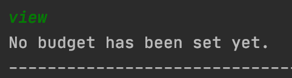

Figure below shows an example for View Budget Limit feature (i.e. budget limit has been set):  

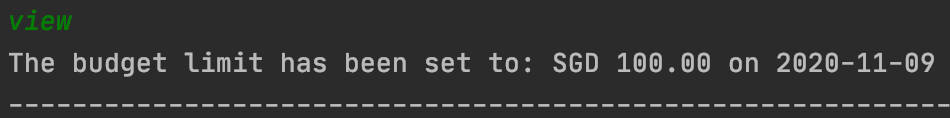

### 3.8 Setting Budget Limit: `set`
This command allows you to set a budget limit. You will receive a Ui warning message when your spending approaches 
the limit or exceeds the limit after setting the budget limit.

🛈 The system only supports three different currencies, including SGD, USD and CNY.

🛈 Only spending items that are added after/on the date of setting the budget limit will be taken into consideration

Format:

`set -s CURRENCY AMOUNT`

Example of usage:

`set -s SGD 100.0` → sets the budget limit to SGD 100.00

Figure below shows an example for Set Budget Limit feature:  

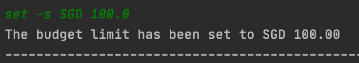

### 3.9 Inputting Repayment Information: `repay`
This command adds a repayment record to your repayment list.

🛈 The system only supports three different currencies, including SGD, USD and CNY.

🛈 The format of deadline is yyyy-MM-dd, and the deadline should be after/including current date.

Format:

`repay -d NAME -s CURRENCY AMOUNT -t DEADLINE`

Example of usage:

`repay -d Johnny -s SGD 5.0 -t 2020-12-02` → stores the information that you need to repay SGD 5.0 to Johnny before 
2020-12-02

Figure below shows an example for Input Repayment Information feature:  

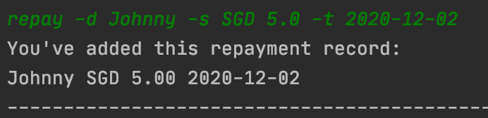

### 3.10 Converting Currency: `convert`
This command converts the currency in your spending list to another currency you prefer.

🛈 The currency converter only supports currency conversion from SGD to USD, or USD to SGD, or SGD to CNY, or CNY to SGD.

🛈 The input currency must match with the default currency in the spending list.

Format: 

`convert -s INPUT_CURRENCY -t OUTPUT_CURRENCY`

Example of usage:

`convert -s SGD -t USD` → converts the currency from SGD to USD

Figure below shows an example for Convert Currency feature:  

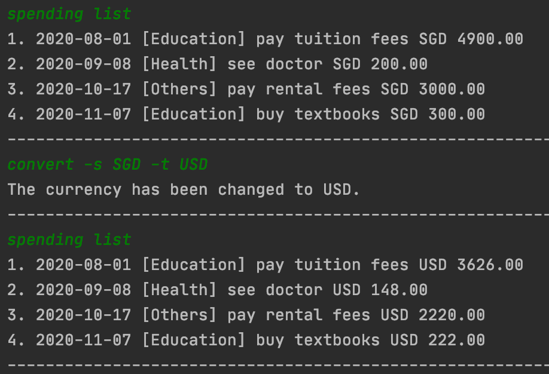

### 3.11 Viewing Summary: `summary`
This command generates a statement of your total expenditure during a specific period of time (a particular year or 
month, or both). Statements based on each spending category will also be shown.

Format: 

`summary [YEAR] [MONTH] [-a]`

Examples of usage:

`summary` → shows summary of current month 

`summary 2020` → shows summary of a specific year 

`summary 2020 Oct` → shows summary of a specific year and month

`summary -a` → shows the summary of total expenditure

Figure below shows an example for Summary feature:  

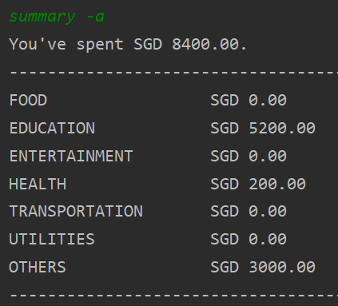

### 3.12 Visualizing Data: `draw` 

This command generates graphs showing your spending records of a particular year or month. The graphs will be in an Excel file at the same folder of this application.

Format: 

`draw [YEAR] [MONTH]`

Examples of usage: 

`draw` → shows the graph of current month

`draw 2012` → shows the graph of year 2012

`draw 2020 Jun` → shows the graph of Jun 2020

### 3.13 Exporting Data: `export` 

This command exports the data to an Excel file at the given location.

Format: 

`export PATH`

Example of usage: 

`export F:\MyFolder` → exports the records to an Excel file located at F:\MyFolder

### 3.14 Editing Spending: `edit`
This command edits the existing records in the spending list.

🛈 The system only supports three different currencies, including SGD, USD and CNY.

🛈 You may enter the command `spending list -a` before entering `edit` to get the acutual `INDEX` of items in the spending list

Format:

`edit INDEX [-c CATEGORY] [-d NEW DESCRIPTION] [-s CURRENCY NEW SPENDING]`

Example of usage:

`edit 2 -c others` → edits the category of the second item in the spending list to others

Figure below shows an example for Edit Spending feature:  

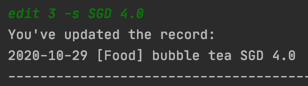

### 3.15 Exiting Program: `logout`
This command exists the application.

Format:

`logout`

Example of usage:

`logout` → exits the program

Figure below shows an example for Exiting Program feature:  

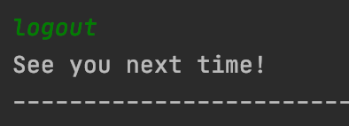

## **4. Useful Hidden Features**
This section shows you the hidden features which serve as notifications and interactions with the user.

### 4.1 Reminder 
Reminds you about your weekly expenditures, and the amount of budget left when you start the application.
It will also warn you if you are reaching your budget limit.  

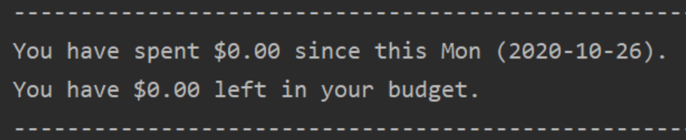

Note: A new week starts on Monday.

### 4.2 Warning
Warns you when you are about to overspend. After you add a spending item and the total expenditure is more than the 
budget threshold, the below warning message will appear.  

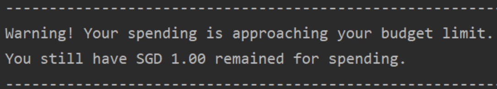

Note: You would receive the warning message only after setting the budget limit.

### 4.3 Encouragement
Being able to create your budget is a great start, but if you do not have the willpower to stick to the budget you have set, you will soon discover that using this application is a waste of your time. Hence, this feature is implemented to motivate you in keeping up your efforts in budgeting. An encouragement message will be shown every eight times you add an item to the spending list.

Figure below shows an example of encouragement message.  

## **5. FAQ**

**Q**: How do I transfer my data to another computer? 

**A**: Install the app in the other computer and copy the data/duke.json to the same folder. When you start the app, it will automatically detect and load the backup data.

**Q**: Are the commands case sensitive?

**A**: Yes, they are. To execute the commands properly, please strictly follow the format given above.

## **6. Command Summary**

| Action | Format | Examples |
|:------:|--------|----------|
|[add](#31-adding-spending-add) | `add -c CATEGORY -d DESCRIPTION -s CURRENCY SPENDING` | add -c Food -d chicken rice -s SGD 5.0|
|[clear](#32-clearing-data-clear) | `clear [-b] [-s SPENDING_INDEX] [-r REPAYMENT_INDEX]` | clear -s 1|
|[convert](#310-converting-currency-convert) | `convert -s INPUT_CURRENCY -t OUTPUT_CURRENCY` | convert -s SGD -t USD|
|[draw](#312-visualizing-data-draw) | `draw [YEAR] [MONTH]`| draw 2020|
|[edit](#314-editing-spending-edit) | `edit INDEX [-c NEW_CATEGORY] [-d NEW_DESCRIPTION] [-s NEW_CURRENCY NEW_SPENDING]` | edit 1 -d bubble tea|
|[export](#313-exporting-data-export) | `export PATH`| export F:\MyFolder|
|[help](#33-viewing-help-help) | `help`| help|
|[logout](#315-exiting-program-logout) | `logout`| logout|
|[purge data](#34-purging-data-purge-data) | `purge data`| purge data|
|[repay](#39-inputting-repayment-information-repay) | `repay -d NAME -s CURRENCY AMOUNT -t DEADLINE` | repay -d Johnny -s SGD 5.00 -t 2020-12-02|
|[repayment list](#35-viewing-repayment-list-summary-repayment-list) | `repayment list`| repayment list|
|[set](#38-setting-budget-limit-set) | `set -s CURRENCY AMOUNT` | set -s SGD 100.00|
|[spending list](#36-viewing-spending-list-summary-spending-list) | `spending list [YEAR] [MONTH] [-c CATEGORY] [-a]`| spending list 2020 Jul|
|[summary](#311-viewing-summary-summary) | `summary [YEAR] [MONTH] [-a]` | summary 2020 Jul |
|[view](#37-viewing-budget-limit-view) | `view`| view|
