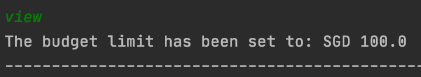
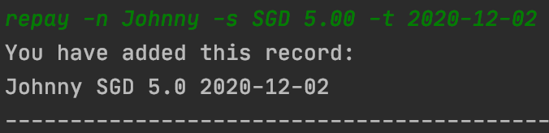
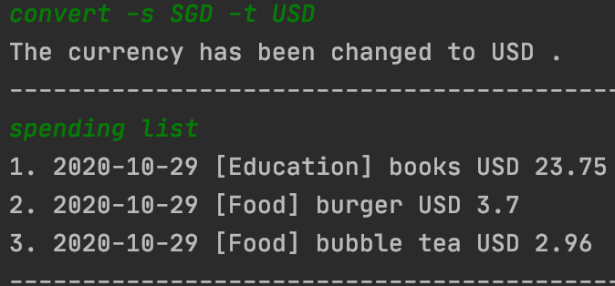

# User Guide

## 1. Introduction
Welcome to Cent Wise Dollar Wise User Guide! Cent Wise Dollar Wise is a desktop application for money management, optimised for use via a Command Line Interface (CLI). This application aims to help NUS hostel students manage their financial situation and track their spending efficiently. 
This user guide provides in-depth documentation on the application’s installation process and command features. 

## 2. Quick Start
1. Ensure that you have Java 11 or above installed in your computer.
2. Download the latest version of `Duke` from [here](http://link.to/duke).
3. Copy the file to a home folder you would like to use.
4. Open a terminal in that home folder and enter java -jar duke.jar to begin.
5. Type the desired command and press Enter to execute it. Tips: entering help will display the help window with a list of commands that could be executed.

Refer to the Features below for details of each command.

## 3. Command Features 
In this section, specific information about each command will be explained. This includes the purpose of each command, and how it is formatted.

Before we begin, do take note of the following information which applies to all commands:
* Words in UPPER_CASE are parameters that you should provide.
Example: In `-c CATEGORY`, `CATEGORY` is a parameter. `-c Food` would mean that the item belongs to the 'food' category.

* Parameters in square brackets (i.e. []) are options provided for you to choose to enter. You may choose one out of all.
Example: `edit INDEX [-c CATEGORY] [-d NEW DESCRIPTION]` can be used as `edit 1 [-c Food]` or `edit 1 [-c NEW DESCRIPTION]`

* The abbreviation of `MONTH` is case sensitive. The system only accepts the abbreviation of `MONTH` with the first three letters, and the first
letter is capitalised. Example: `Jul` for July or `Oct` for October.

* The system has the feature of a currency converter, but it only supports currency conversion for SGD to USD, or USD to SGD, or SGD to CNY, or CNY to SGD.

* The default currency of the system is SGD.

* There are six different categories provided, including Education, Entertainment, Food, Health, Transportation and Utilities. Other tasks could be categorised under the category of Other.

### 3.1 Viewing Repayment List Summary: `repayment list`
This command shows your repayment list.

Format:

`repayment list`

### 3.2 Viewing Spending List Summary: `spending list`
This command shows your spending records during a specified period (a particular year or month, or both).
You can also choose to view your spending records which belong to a specific spending category.

Format:

`spending list [YEAR] [MONTH] [-c CATEGORY] [-a]`

Examples of usage:

`spending list` → lists all entries for the current month

`spending list 2020 Jul` → lists all entries for July 2020

`spending list -c Food` → lists all food entries for the current month

`spending list -a` → lists all entries

### 3.3 Viewing Budget Limit: `view`
This command shows the current budget limit you have set.

Format:

`view`

Example of usage:

`view` → views the budget limit that was set previously

Feature below shows an example for Viewing Budget Limit feature (i.e. budget limit has not been set yet):

Feature below shows an example for Viewing Budget Limit feature (i.e. budget limit has been set):

### 3.4 Setting Budget Limit: `set`
This command allows you to set a budget limit. You will receive a Ui warning message when your spending approaches 
the limit or exceeds the limit.

Format:

`set -s AMOUNT`

Example of usage:

`set -s SGD 100.0` → sets the budget limit to SGD 100.0

### 3.5 Inputting Repayment Information: `repay`
This command adds a repayment record to your repayment list.

Format:

`repay -n NAME -s AMOUNT -t DEADLINE`

Example of usage:

`repay -n Johnny -s SGD 5.0 -t 2020-12-02` → stores the information that you need to repay SGD 5.0 to Johnny before 
2020-12-02

Feature below shows an example for Inputting Repayment Information feature:

### 3.6 Converting Currency: `convert`
This command converts the currency in your spending list to another currency you prefer.

Format: 

`convert -s INPUT_CURRENCY -t OUTPUT_CURRENCY`

Example of usage:

`convert -s SGD -t USD` → converts the currency from SGD to USD

Feature below shows an example for Converting Currency feature:

### 3.7 Viewing Summary: `summary`
This command generates a statement of your total expenditure during a specific period of time (a particular year or 
month, or both). Statements based on each spending category will also be shown.

Format: 

`summary [YEAR] [MONTH] [-a]`

Examples of usage:

`summary` → shows summary of current month

`summary 2020` → shows summary of a specific year

`summary 2020 Oct` → shows summary of a specific year and month

`summary -a` → shows the summary of total expenditure

### 3.8 Visualizing data: `draw`
This command generates graphs showing your spending records of a particular year or month. The graphs will be in an Excel file at the same folder of this application.

Format: 

`draw [YEAR = current year] [MONTH = current month]`

Examples of usage: 

`draw` → shows the graph of current month

`draw 2012` → shows the graph of year 2012

`draw 2020 Jun` → shows the graph of Jun 2020

### 3.9 Exporting data: `export`
This command exports the data to an Excel file at the given location.

Format: 

`export PATH`

Example of usage: 

`export F:\MyFolder exports` → the records to an Excel file located at F:\MyFolder

### 3.10 Editing spending: `edit`
This command edits the existing records in the spending list.

Format:

`edit INDEX [-c CATEGORY] [-d NEW DESCRIPTION] [-s NEW SPENDING]`

Example of usage:

`edit 3 -s SGD 4.0` → edits the amount in the first item in the spending list to SGD 4.0

Feature below shows an example for Editing Spending feature:

## 4. Useful Hidden Features
This section shows you the hidden features which serve as notifications and interactions with the user.

### Reminder 
Reminds you about your weekly expenditures, and the amount of budget left when you start the application.
It will also warn you if you are reaching your budget limit.

Note: A new week starts on Monday.

### Warning
Warns you when you are about to overspend. The budget threshold is 90% of your budget set. After you add a spending 
item and the total expenditure is more than the budget threshold, warning message will appear.

Note: You need to set the budget in order to get the warning feature.

### Encouragement
Encourages you when you add spending items.

## 5. FAQ

**Q**: How do I transfer my data to another computer? 

**A**: Install the app in the other computer and copy the data/duke.json to the same folder. When you start the app, it will automatically detect and load the backup data.

**Q**: Are the commands case sensitive?

**A**: Yes, they are. To execute the commands properly, please strictly follow the format given above.

## 6. Command Summary
Action | Format & Examples 
--- | ---
add | `add  -c CATEGORY -d DESCRIPTION -s SPENDING`   e.g. add -c Food -d chicken rice -s GSD 5.0
clear | `clear KEYWORD`   e.g. clear 1
convert | `convert -s DESCRIPTION -t DESCRIPTION`   e.g. convert -s SGD -t USD
draw | `draw [YEAR = current year] [MONTH = current month]`
edit | `edit INDEX [-c CATEGORY] [-d NEW_DESCRIPTION] [-s NEW_SPENDING]`   e.g. edit 1 -d bubble tea
export | `export PATH`
help | `help`
logout | `logout`
purge data | `purge data`
repay | `repay -n NAME -s AMOUNT -t DEADLINE`   e.g. repay -n Johnny -s SGD 5.00 -t 2020-12-02
repayment list | `repayment list`
set | `set -s AMOUNT`   e.g. set -s SGD 100.00
view | `view`
spending list | `spending list [YEAR = current year] [MONTH = current month] [-c CATEGORY] [-a]`   e.g. spending list 2020 Jul
summary | `summary [YEAR = current year] [MONTH = current month] [-a]`   e.g. summary 2020 Jul 
